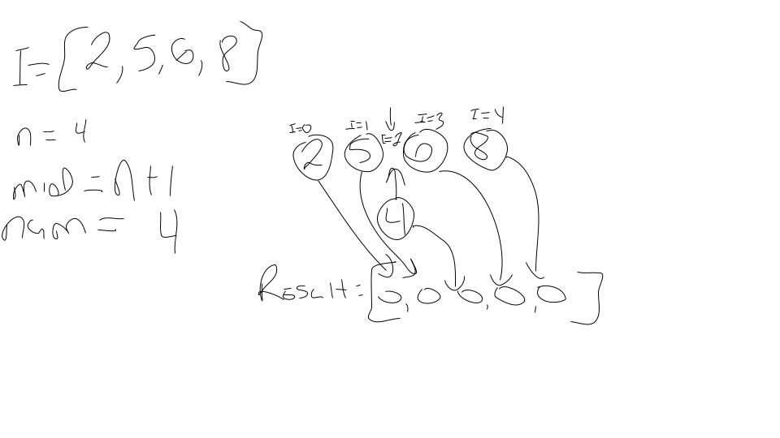
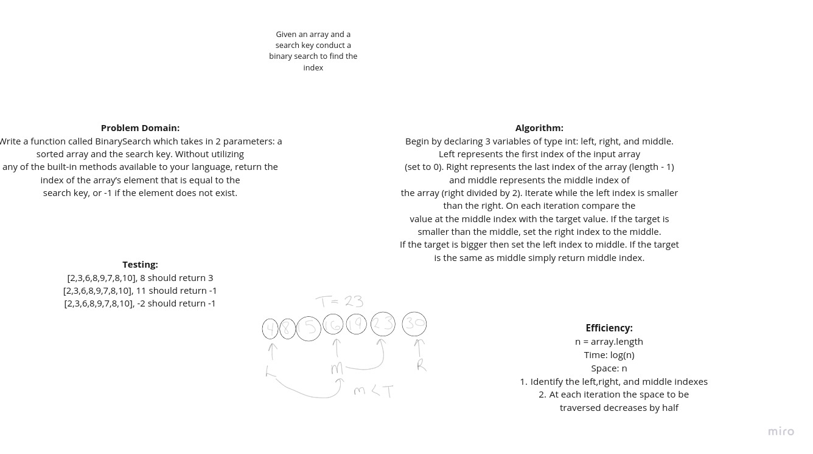
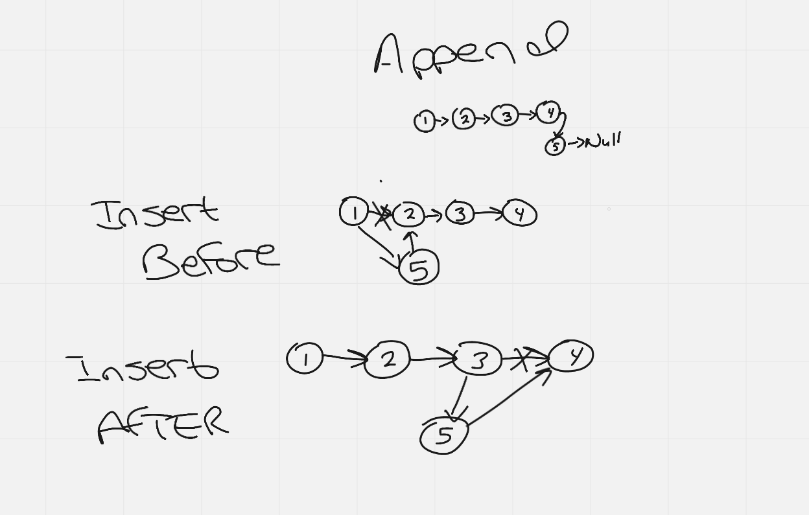
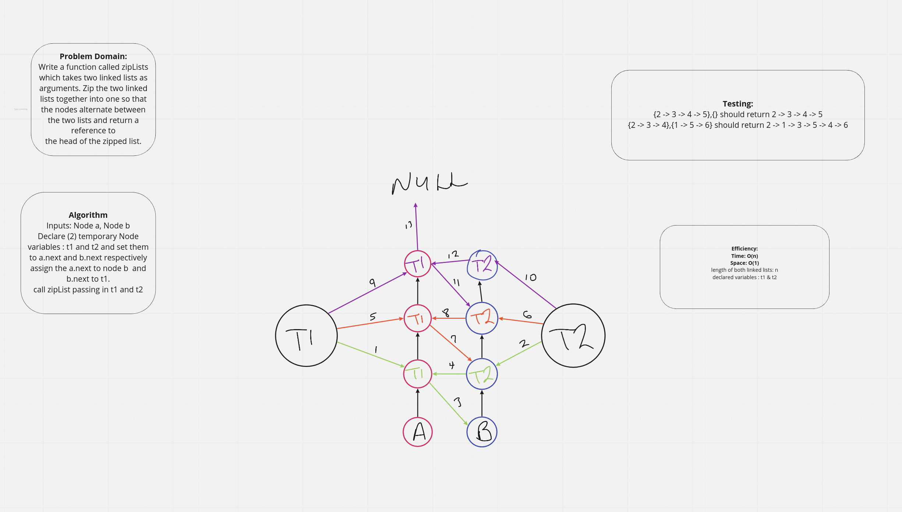
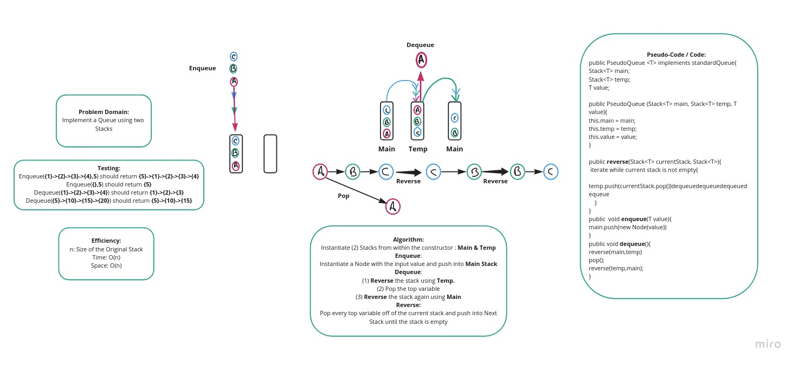
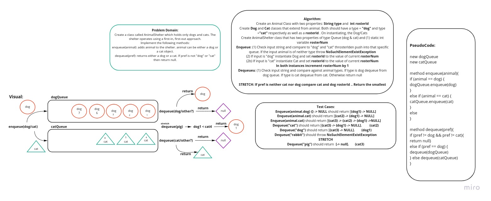
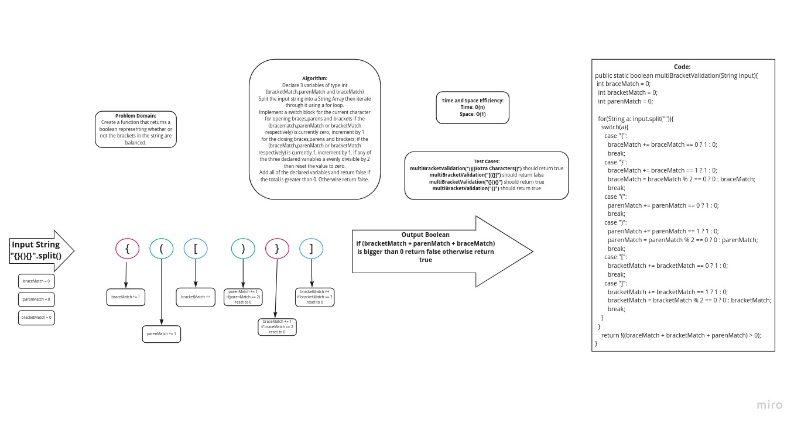
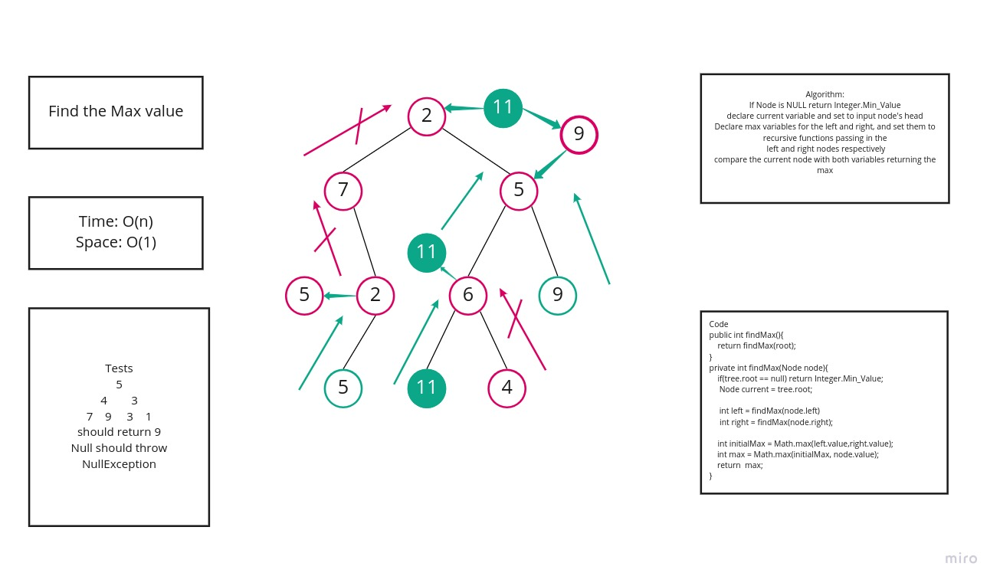

# ArrayShift
# Challenge Summary
Insert and shift an array in middle at index

## Challenge Description
Write a function called insertShiftArray which takes in an array and the value to be added. Without utilizing any of
the built-in methods available to your language, return an array with the new value added at the middle index.

## Approach & Efficiency
Begin by cloning the input array and increasing its size by 1. Then proceed to find the middle index by dividing the
length of the input array by 2.Since the type of variable for the middle index is `int` there is not need to round.
At this point iterate through the cloned array setting each value to the corresponding value from the input array until
reaching the middle index. Once the middle index is reached,set that value as the input number. To avoid receiving an
out of bounds error, subtract 1 from the remaining indexes by 1 and continue to set the corresponding values.

## Solution

# Linked List Implementation

Perform a Linked List implementation.

## Challenge Description
Create a `Node` class that has properties for the value stored in the `Node`, and a pointer to the next Node.
Within your `LinkedList` class, `include` a `head` property. Upon instantiation, an empty Linked List should be created.
Define a method called insert which takes any value as an argument and adds a new node with that value to the head
of the list with an `O(1)` Time performance. Define a method called includes which takes any value as an argument and
returns a `boolean` result depending on whether that value exists as a Node’s value somewhere within the list.
Define a method called toString  which takes in no arguments and returns a string representing
all the values in the Linked List, formatted as:

## Approach & Efficiency

- **Insert** : takes any value as an argument and adds a new node with the value to the head of the list wih an O
  (1) Time performance
- **Includes** : takes any value as an argument and returns a boolean result depending on whether that value exists
  as a Node's value somewhere within the list
- **ToString** : takes in no arguments and returns a string representing all the values in the Linked List

# Binary Search

# Challenge Description
Write a function called BinarySearch which takes in 2 parameters: a sorted array and the search key. Without utilizing
any of the built-in methods available to your language, return the index of the array’s element that is equal to the
search key, or -1 if the element does not exist.

## Approach & Efficiency
Begin by declaring 3 variables of type int: left, right, and middle. Left represents the first index of the input array
(set to 0). Right represents the last index of the array (length - 1) and middle represents the middle index of
the array (right divided by 2). Iterate while the left index is smaller than the right. On each iteration compare the
value at the middle index with the target value. If the target is smaller than the middle, set the right index to the middle.
If the target is bigger set the left index to middle. If the target is the same as middle simply return middle index.

## Solution

# Linked List Insertions

## Challenge Description
Write the following methods for the Linked List class:

`.append(value)` which adds a new node with the given value to the end of the list
`.insertBefore(value, newVal)` which add a new node with the given newValue immediately before the first value node
`.insertAfter(value, newVal)` which add a new node with the given newValue immediately after the first value node
`.delete(value)` which removes a node with the given value.

## Approach & Efficiency
*Append:* Begin by declaring a new Node value and set the tail.next to the newNode. Then set the
newNode as the current tail.

*InsertBefore*: Declare a newNode and set its next node to the current heads next node.Then set
the current head's next node to the newNode. Consider edge case in case the node is the current
head or tail. If it is the head, set the newNode to be the current head (using insert) and it's
next to the
previous head.

*Insert After*: Compare the targetValue to the values of the current head and tail. If it is the
head
set the head's pointer to the newNodeand the heads previous pointer to the pointer of the new
node. If the targetValue matches with the tail, set the current tail to be the newValue.

*Delete*: If target value is either the head or tail, set the current heads pointer to null or set
the tail's previous to null. If any other value matches the target set the pointer of the
previous Node to be the original next of the target. Set the targets pointer to null;

## Challenge Description
Write a method for the Linked List class which takes a number, k, as a parameter. Return the node’s
value that is k from the end of the linked list. You have access to the Node class and all the
properties on the Linked List class as well as the methods created in previous challenges.

## Challenge Description
Write a function called `zipLists` which takes two linked lists as arguments. Zip the two linked
lists
together into one so that the nodes alternate between the two lists and return a reference to
the head of the zipped list.
## Approach & Efficiency
I decided to use the recursive method manipulating two temporary variables representing the next
Node within each list to be zipped together. At each iteration we set the current node A and
node B to temporary variables and reassign their pointers as necessary.

## Solution

# Stacks and Queues

## Challenge
Create a Node class that has properties for the value stored in the Node, and a pointer to the next node.
Create a Stack class that has a top property. It creates an empty Stack when instantiated. Create
a Queue class that has a front property. It creates an empty Queue when instantiated.
This object should be aware of a default empty value assigned to front when the queue is created.

## Approach & Efficiency
Similar to the linked List all of the methods have a space and time complexity of O(1).

## API

`Push` - takes any value as an argument and adds a new node with that value to the top of the
stack with an O(1) Time performance.
`Pop` - oes not take any argument, removes the node from the top of the stack, and returns the
node’s value.
`Peek` - does not take an argument and returns the value of the node located on top of the stack,
without removing it from the stack.
`isEmpty` - takes no argument, and returns a boolean indicating whether or not the stack is empty.

`Enqueue` - takes any value as an argument and adds a new node with that value to the back of the
queue with an O(1) Time performance.
`Dequeue` - does not take any argument, removes the node from the front of the queue, and returns
the node’s value.
`Peek` - oes not take an argument and returns the value of the node located in the front of the
queue, without removing it from the queue.
`IsEmpty` - takes no argument, and returns a boolean indicating whether or not the queue is empty.

# PseudoQueue
Implement a Queue using two Stacks.

## Challenge

Create a brand new PseudoQueue class. Do not use an existing Queue. Instead, this PseudoQueue
class will implement our standard queue interface (the two methods listed below), but will
internally only utilize 2 Stack objects.

## Approach & Efficiency

For this challenge I decided to create a help function `reverse` which takes the main Stack and
pushes all of its contents into a temporary stack. When executing the `enqueue` method the Node
is simply added to the top of the stack. Executing the `dequeue` method while execute `reverse`
then pop the top Node off of the stack then execute `reverse` once more.

## Solution

# Challenge Summary
Create a class called AnimalShelter which holds only dogs and cats. The shelter operates using a first-in, first-out approach.

## Challenge Description

Implement the following methods:
`enqueue(animal)`: adds animal to the shelter. animal can be either a dog or a cat object.
`dequeue(pref)`: returns either a dog or a cat. If pref is not "dog" or "cat" then return null.

## Approach & Efficiency
For this challenge I decided to create two stacks (one for dogs and another for cats). The input
would be an Animal object. On execution the enqueue function would assess the type of the object
and push the object into its respective queue. Any other input would throw a
NoSuchElementExistsException. Dequeuing would compare the input string to the type of animal
(Dog or Cat)then return that value.

## Solution

# Challenge Summary
Create a function that takes a string as its only argument, and returns a boolean
representing whether or not the brackets in the string are balanced
## Challenge Description
There are 3 types of brackets:

- Round Brackets : `()`
- Square Brackets : `[]`
- Curly Brackets : `{}`

  
## Approach & Efficiency
I decided to implement a counter for each group of opening and closing brackets. I began by
spliting the input string into a String array and iterating through it. Whenever an opening
character is found, the function checks if the corresponding counter is set to 0, then
increments by 1. The counter will only increment if the current element is the closing character.
Once the counter becomes divisible by 2 (meaning a match was made) it is then reset to zero.
Once outside of the loop, we add up all of the counters and check to see if the total is greater
than 0. If it is we return false otherwise return true.

#Trees

#Challenge
Create a Node class that has properties for the value stored in the node, the left child node, and the right child node.
Create a BinaryTree class with a method for each of the depth first traversals called `preOrder`,
`inOrder`, and `postOrder`  returning an array of the values, ordered appropriately.

## Approach & Efficiency
`preOrder` -
`inOrder` -
`postOrder` -
`add` - Accepts a value, and adds a new node with that value in the correct location in the
binary search tree.
`contains` - Accepts a value, and returns a boolean indicating whether or not the value is in
the tree at least once.

# Challenge Summary
Find the Maximum Value in a Binary Tree

## Challenge Description
Write an instance method called find-maximum-value. Without utilizing any of the built-in
methods available to your language, return the maximum value stored in the tree. You can assume that the values stored in the Binary Tree will be numeric.

## Approach & Efficiency
If Node is NULL return Integer.Min_Value declare current variable and set to input node's head.
Declare max variables for the left and right, and set them to recursive functions passing in the
left and right nodes respectively. Compare the current node with both variables returning the max

## Solution

